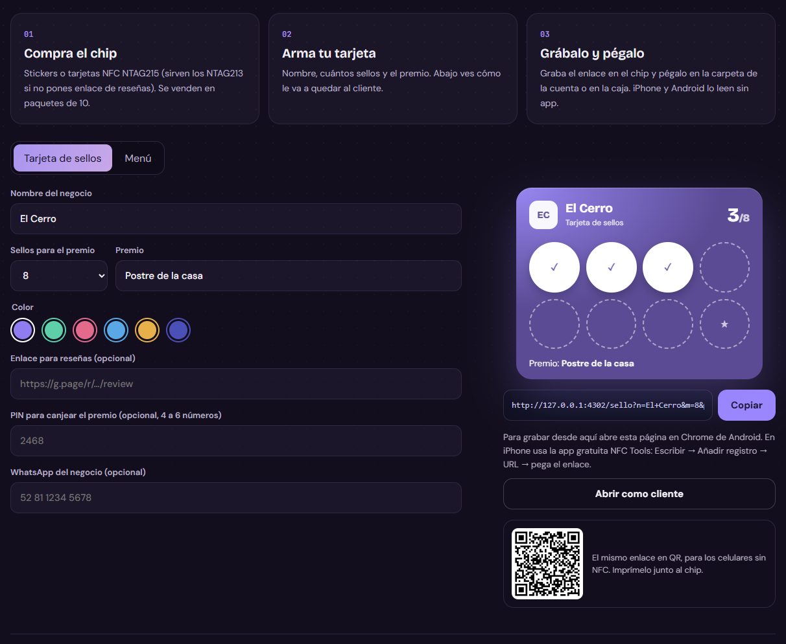

# NFC para negocios

[](https://github.com/Brunich/nfc-negocios/actions/workflows/ci.yml)

*Que vuelvan, sin quitarles tiempo.*

Una tarjeta de sellos en el celular, como la de cartón de cualquier café: cada visita suma uno y al completarla hay premio. Es para que el cliente vuelva y el negocio lo atienda mejor, y al cliente le cuesta un segundo: acercar el celular al chip.



**Pruébalo en vivo:** [bruno-portfolio-azure.vercel.app/proyectos/club-nfc](https://bruno-portfolio-azure.vercel.app/proyectos/club-nfc)

## Cómo funciona

1. **Tap.** El cliente acerca su celular al chip de la cuenta o del mostrador. Se abre su tarjeta: sin app y sin llenar nada.
2. **Sello.** Suma uno por visita, máximo uno al día. Con la tarjeta llena, el premio que el negocio eligió: un postre, un café, un descuento.
3. **Vuelve.** Los sellos le dan una razón para regresar, y al negocio una forma de atenderlo: pedir su reseña o invitarlo de nuevo.
4. **Menú.** El mismo chip o un QR en la mesa abre la carta; el cliente arma su pedido y lo manda por WhatsApp.

## Qué hay adentro

| Archivo | Qué hace |
| --- | --- |
| `src/stamp-logic.ts` | Qué dice el enlace del chip (negocio, meta, premio, color), un sello por día y la huella del PIN de canje. |
| `src/Stamp.tsx` | La tarjeta que ve el cliente (`/sello`) y el armador del negocio, con QR y grabado por Web NFC. |
| `src/menu-logic.ts` | El menú viaja comprimido dentro del enlace (lz-string) y se calcula qué chip alcanza: NTAG213, 215 o 216. |
| `src/Menu.tsx` | La carta (`/menu`) con pedido por WhatsApp, y el editor del menú con número de mesa. |

La lógica está separada de la interfaz, así se prueba sin navegador (`tests/`).

## Decisiones

- Sin servidor: los datos del negocio viajan en el enlace que se graba en el chip, y los sellos viven en el celular del cliente.
- Un sello por día como máximo, para que no se pueda llenar la tarjeta en una sola visita.
- El PIN de canje no va en el enlace: sólo una huella SHA-256 atada al nombre del negocio.
- En Android (Chrome) el chip se graba desde la página con Web NFC; en iPhone se graba con una app como NFC Tools y se lee sin app.

## Correrlo

```bash
npm install
npm run dev
```

```bash
npm test        # pruebas de la lógica (node:test)
npm run build   # tipos + build de producción
```

Hecho con React 19, TypeScript y Vite. Necesita Node 22 o más nuevo (las pruebas corren TypeScript directo con Node).

## Lo que sigue

- Panel del negocio con cuántos clientes regresan (eso sí necesita servidor).
- Tarjetas firmadas para que no se puedan copiar de un celular a otro.

---

Parte del [portafolio de Bruno Salas](https://bruno-portfolio-azure.vercel.app) · [GitHub](https://github.com/Brunich)
